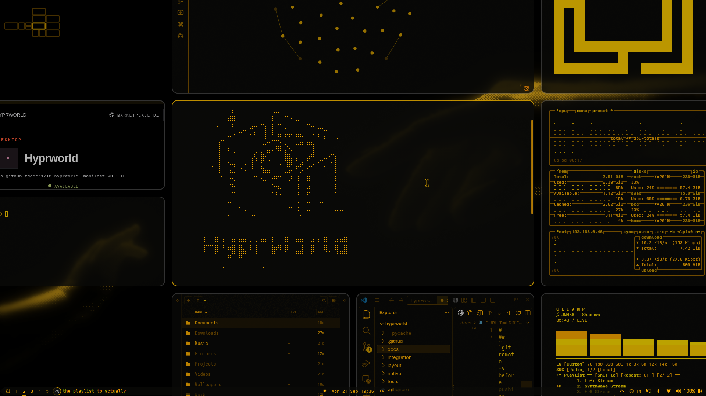

# Hyprworld

A two-dimensional scrolling layout for **Hyprland with Omarchy Shell**.
Arrange windows across a grid, group them into visible tiles, and navigate with
an interactive overview, minimap, and smooth camera zoom.

Hyprworld is an independent fork of
[Hyprscroll2D by Kirollos Atef](https://github.com/kirollosatef/hyprscroll2d).
The original layout and integration form its foundation; this fork adds a
substantially expanded grouping, navigation, and settings workflow. See
[CREDITS.md](CREDITS.md) and the preserved [MIT license](LICENSE).

Install this project through Omarchy, not `hyprpm`.

**Compatibility:** tested with Omarchy 4.0.4 and Hyprland 0.56.2 (Lua configuration).
The native helper must be compiled against the exact running Hyprland version.
The interface uses Omarchy Shell components and is not a standalone Quickshell app.



## Features

- Scrolling and camera movement in both dimensions.
- Groups of two, three, or four visible windows, with drag grouping and swaps.
- Interactive overview with keyboard navigation, dragging, and workspace transitions.
- Minimap with fixed or fit sizing, smooth fit-size transitions, adjustable placement, opacity, and outlines.
- Continuous drag outlines within and across monitors, including the destination drop preview.
- Automatic settled-layout checkpoints that restore open-window arrangements after plugin resets.
- Continuous mouse-wheel zoom and keyboard zoom presets.
- Shared workspaces with no fixed upper limit; requesting a visible remote workspace swaps monitors.
- Searchable settings with 19 configurable shortcuts, key capture, and conflict highlighting.
- Custom opening paths, optional workspace targeting, and layouts for each group size.
- Captured startup workspace templates with application launching and grouping.
- Hover or click focus, configurable compaction, and touchpad navigation.

## Install

You need an Omarchy installation with its Lua Hyprland configuration, Omarchy
Shell/Quickshell, `omarchy plugin`, Python 3, libxkbcommon, and the native build dependencies below.
The QML interface depends on Omarchy's shell components; it is not a standalone
Quickshell configuration.

Install from [tdemers218/hyprworld](https://github.com/tdemers218/hyprworld).
Install the build dependencies before enabling. The shell builds and caches the
matching helper automatically; `make native` below also checks the build locally.
The following add command installs without the interactive enable prompt:

```sh
omarchy plugin add https://github.com/tdemers218/hyprworld.git --yes
make -C ~/.config/omarchy/plugins/io.github.tdemers218.hyprworld native
omarchy plugin enable io.github.tdemers218.hyprworld
```

The plugin ID is `io.github.tdemers218.hyprworld`. Do not use the Hyprscroll2D upstream URL: it
installs the original plugin. If migrating, follow [the migration guide](docs/MIGRATING.md)
first; run only one of the two layouts' Omarchy integrations at a time.

All monitors share the same workspace numbers. Requesting a workspace visible
on another monitor swaps it with the current workspace, keeping focus on the
requesting monitor. Hidden remote workspaces move here without changing the
other monitor's visible workspace. The swap animation follows monitor positions,
including vertical and diagonal arrangements. Mouse movement and Super+Tab still
change monitor focus normally. The bar always shows 1–5, higher workspace numbers that contain windows, and the current workspace even when empty.

The native helper requires a C++23 compiler (`gcc`), Make, `pkgconf`, and Hyprland
headers matching the running compositor. On Omarchy these headers come with the
Hyprland package. Install missing build tools with `omarchy pkg add base-devel`.
See the update procedure below after changing Hyprland or the plugin.

Choose the Hyprworld workspaces widget when prompted for bar placement. It can
replace the normal workspace widget through Omarchy's bar configuration.

### First use

1. Press **Super+1** on the focused monitor and open a few windows.
2. Use **Super+Arrow** to focus and **Super+Shift+Arrow** to move or group them.
3. Press **Super+O** to explore the overview; select a card to return to it.
4. Press **Super+Shift+L** to open settings.

## Controls

| Action | Default binding |
| --- | --- |
| Focus a window | Super+Arrow |
| Move, group, detach, or swap | Super+Shift+Arrow |
| Shrink width / height | Super+Alt+Left / Up |
| Grow width / height | Super+Alt+Right / Down |
| Toggle default / maximum tile size | Super+Alt+F |
| Zoom in / out | Super+Ctrl+Up / Down |
| Smooth zoom | Super+mouse wheel |
| Pan camera | Super+middle mouse drag |
| Move or group with pointer | Super+left mouse drag |
| Toggle overview | Super+O |
| Focus with touchpad | Three-finger swipe in any direction |
| Continuous zoom with touchpad | Two-finger pinch / spread |
| Previous / next workspace with touchpad | Four-finger swipe left / right |
| Toggle overview with touchpad | Four-finger swipe up / down |
| Open settings | Super+Shift+L |
| Select workspace 1–10 | Super+1–0 |
| Move window to workspace and follow | Super+Shift+1–0 |
| Move window without following | Super+Shift+Alt+1–0 |
| Previous / next workspace | Super+Ctrl+Left / Right |
| Previous workspace on this monitor | Super+Ctrl+Tab |
| Next / previous monitor | Super+Tab / Super+Shift+Tab |

Workspace number bindings use physical number-row keycodes. Workspace stepping
stops at 1 in the left direction and keeps creating workspaces to the right.
The minimap and overview are hidden while screensaver windows are present.
The minimap also hides while any window is fullscreen.
Some other Omarchy shortcuts are replaced too; inspect the Shortcuts tab and
`integration/omarchy.lua` before adapting an existing custom keymap. Outside the
layout, only actions with an explicit fallback retain their normal behavior.

The old split/pseudo, saved-width, and minus/equal resize shortcuts are removed.
Native tab-group shortcuts remain available. Touchpad callbacks use Hyprland's
[Lua gesture API](https://wiki.hypr.land/Configuring/Advanced-and-Cool/Gestures/).

### Groups and overview

Dropping a window onto another creates or extends a group. By default, two windows share
halves, three use one half and two quarters, and four use quarters. Settings can
replace these arrangements with rows, columns, grid, or master layouts. A full
four-window destination swaps complete cells. These groups are visible tiles,
not native Hyprland tab groups. Moving a member outward detaches it; moving
within a group swaps member positions. Super+left-drag across monitors shows a
click-through outline on the destination; release moves the window to that
monitor's active workspace. Super+middle-drag camera panning still cancels at a
monitor boundary. The outline follows continuously on both source and destination.

Overview displays the current workspace number. Type in the search field to fuzzy
match windows across workspaces using titles, application names, and all metadata
exposed by Hyprland (including initial titles, workspace, PID, and tags). Up/Down
select results, Enter activates one, and Escape clears the search before closing.

In overview, arrows select, Shift+arrows move/group, Alt+arrows resize, and
left-drag moves cards. Super+middle-drag pans. The configured workspace shortcuts
also work, including on empty workspaces. Click a card, press Enter/Escape, or
zoom in to return to the selected window. Click empty space or toggle overview
to close it.

## Settings

Open **Super+Shift+L** for settings. The icon sidebar contains
Minimap, Overview, Flow, Placement paths, Group layouts, Startup workspaces,
Shortcuts, and Plugin. Search across controls, expand advanced options, and preview
changes before **Apply**. **Revert** discards the draft; section defaults are also
kept in the draft until applied.

Minimap and overview include visibility, geometry, labels, colors and animation
controls. Minimap **Sizing mode** selects fixed or fit sizing. Fit respects the
maximum dimensions and focused-window geometry; switching focus to a same-sized
window keeps its fit stable. When a new fit is needed, position, size and scale
glide together using **Movement duration** (300 ms by default). Disabling
animations or setting that duration to zero makes the transition immediate.

Flow contains compaction, focus, geometry and touchpad sensitivity.
Placement paths can open windows horizontally, vertically, or along custom ordered
branches with grouped tiles. Select **Custom**, click a tile, then click one of its
neighboring **+** buttons. Arrow keys do the same when the canvas is focused. Use
**All workspaces** or enter specific workspace numbers. Group size controls how
many windows fill each tile before the next one. Changes affect newly placed windows.
Group layouts can be configured separately for two,
three or four windows, including master-left, master-right and master-top with draggable splits.

Startup templates save workspace/monitor, app classes and commands, positions,
groups, and zoom. Capture an existing tiled workspace, supply launch commands, and
launch it manually or enable it for startup. Existing matching windows are reused.
Automatic startup is off by default and runs at most once per compositor session.
Use one template per destination workspace: saved template geometry applies when
matching windows enter that workspace, even when automatic launching is off.
Blank launch commands reuse existing windows only; missing apps need a command.
Capturing selects the new template for editing. A disconnected preferred monitor
falls back to normal workspace assignment.

Shortcuts have fuzzy search, a customized filter, individual defaults and conflict
checks. **Capture** records a physical key while showing its readable name. Press
Escape to cancel. **Check conflicts** outlines every affected field in red;
Apply also validates bindings before saving. Settings live in `~/.config/omarchy/hyprworld.json`. Appearance and Flow
changes apply live; shortcut/plugin-enable changes reload Hyprland. Settled
layouts restore from the latest checkpoint in the same compositor session.
See [layout recovery](docs/LAYOUT-RECOVERY.md) for what is saved and its limits.

See [the settings reference](docs/SETTINGS-OVERHAUL.md) for implemented controls,
design decisions, limitations and the remaining advanced proposals.

## Update, disable, or uninstall

Save your work before updating. Run:

```sh
omarchy plugin update io.github.tdemers218.hyprworld
hyprctl configerrors
```

The shell builds the helper in `$XDG_CACHE_HOME/hyprworld/` (normally
`~/.cache/hyprworld/`) outside the watched plugin directory. Source-only reloads
retain the loaded helper. **When native code or Hyprland changes, log out and
back in to activate the matching helper.** A shell restart or `hyprctl reload`
does not replace a loaded native binary. After upgrading Hyprland, start the new
compositor before loading code built against its headers. Do not manually unload
a live workspace hook as a routine update step.

This update introduces checkpoints; an installation that has not yet run the
new saver has no checkpoint to restore. After activation, let the layout settle
before reloading. Checkpoints preserve the current compositor session, not logout
or reboot; use startup templates to reopen a planned set of applications.

For a temporary pause, disable Hyprworld in its settings panel; use the same
shortcut to re-enable it. For removal, disable it there first, remove any manual
config loader/workspace rules if you added them, then run:

```sh
omarchy plugin remove io.github.tdemers218.hyprworld --yes
hyprctl reload
hyprctl configerrors
```

Log out and back in to finish removing native code from the process. Preferences
and checkpoints outside the plugin directory remain available. Removing the shell
plugin makes its settings shortcut unavailable.

## Troubleshooting

- **Nothing appears:** confirm the plugin is enabled and inspect
  `hyprctl configerrors`. Verify your Hyprland supports the Lua layout API.
- **Wrong workspaces or duplicated bindings:** disable the previous Hyprscroll2D
  integration and check for a manually installed config block; see migration.
- **Settings will not apply:** resolve highlighted shortcut conflicts first.
- **Layout recovery:** wait 1.5 seconds after changes settle, with the full shell
  service running. See [checkpoint files, restoration and limits](docs/LAYOUT-RECOVERY.md).
- **Helper build/load fails:** check matching Hyprland headers and build tools.
  If an incompatible helper is already loaded, save work and start a new desktop
  session after removing the old integration; do not load both plugins.
- **Outline updates slowly:** ensure the updated Service and Lua layout are both
  active. Normal dragging uses compact events; the two-second poll is recovery
  only. Include monitor scale and window count in a bug report.
- **Layout loads but no settings/overview:** use the full Omarchy shell plugin;
  the config installer loads only the Lua integration.

Automated regressions cover the layout and settings logic. Isolated compositor
checks cover actual window placement, workspace swaps in multiple monitor
arrangements, overlays, settings editing, startup launching, full preview event
reassembly, drag updates, and checkpoint restoration on active/inactive workspaces.
Compatibility outside the version above is unverified. Groups remain limited to four windows;
there are no live window thumbnails or complete session restoration.

Report fork-specific problems in **this repository's Issues tab** with versions,
monitor geometry, reproduction steps, and relevant configuration errors.

## Other installation and development

[Advanced installation](docs/INSTALLATION.md) covers the config-only installer
and the Lua entry point. [Migration](docs/MIGRATING.md) explains renamed settings
and identifiers. [Contributing](CONTRIBUTING.md) covers testing and bug reports;
[design notes](docs/DESIGN.md) explain the implementation.

Run the automated suite with Lua 5.4, Python 3, Node.js, Bash, and Make installed:

```sh
make check
```

See [CHANGELOG.md](CHANGELOG.md) for the fork's changes and upstream history.

## Compatibility and performance audit

See [compatibility and failure safety](docs/COMPATIBILITY-AUDIT.md) and
[CPU measurements and rendered checks](docs/PERFORMANCE-AUDIT.md).
The minimap keeps its fit across same-sized focus changes. Cross-monitor window
drags show a click-through destination outline and release hint.

The September 23 checks passed repeated reloads while retaining the native
helper, checkpoint recovery, and continuous local/remote outlines. The earlier
CPU measurements establish a settings-read optimization, not an overall CPU
reduction. Historical freeze diagnosis remains qualified in the audit documents.
For release notes and publishing steps, see [CHANGELOG.md](CHANGELOG.md) and
[the publishing guide](docs/PUBLISHING.md).
